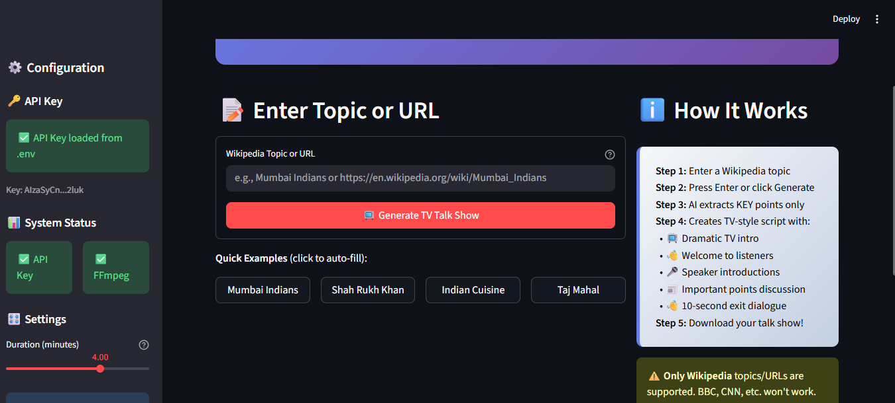

# 📺 Technical Design Document
## The Synthetic Talk Show Host
### AI-Powered Hinglish Radio Conversation Generator

---

## Table of Contents

1. [Project Overview](#1-project-overview)
2. [Track Selection](#2-track-selection)
3. [System Architecture](#3-system-architecture)
4. [Setup & Deployment Instructions](#4-setup--deployment-instructions)
5. [Code Explanation](#5-code-explanation)
6. [Assumptions & Constraints](#6-assumptions--constraints)
7. [Sample Output](#7-sample-output)
8. [Future Scope](#8-future-scope)

---

## 1. Project Overview

### 1.1 Problem Statement

Traditional content consumption requires visual attention (reading articles, watching videos). There's a growing demand for **audio-first content** that can be consumed while multitasking - during commutes, workouts, or household chores.

### 1.2 Solution

**The Synthetic Talk Show Host** is an AI-powered pipeline that transforms Wikipedia articles into engaging, TV-style talk show conversations in **Hinglish** (Hindi + English in Roman script). The system generates a **maximum 5-minute** conversational podcast between two Indian hosts, featuring:

| Feature | Description |
|---------|-------------|
| **TV Show Style Opening** | Dramatic welcome, host introductions |
| **Natural Hinglish** | Mix of Hindi and English in Roman script |
| **Key Points Only** | Extracts only important facts from articles |
| **Dual Hindi Voices** | Authentic Indian accent using Hindi TTS voices |
| **Natural Pauses** | Proper comma pauses for realistic conversation |
| **Professional Exit** | "Tab tak ke liye goodbye!" style ending |

### 1.3 Key Features

| Feature | Description |
|---------|-------------|
| **Automatic Content Extraction** | Fetches and processes Wikipedia articles |
| **Smart Summarization** | Extracts only KEY important points |
| **TV Show Format** | Professional intro, speaker intros, focused content, quick exit |
| **Hindi TTS Voices** | `hi-IN-MadhurNeural` (male), `hi-IN-SwaraNeural` (female) |
| **Long Sentence Breaking** | Auto-adds pauses in long sentences |
| **Pronunciation Fixes** | Handles "US dollars", abbreviations correctly |

### 1.4 Target Users

- Students wanting to learn while commuting
- Professionals seeking audio summaries
- Content creators needing quick audio content
- Accessibility for visually impaired users

---

## 2. Track Selection

### 2.1 Hackathon Track: **AI/ML Audio Generation**

This project falls under the **AI-Powered Content Generation** track, specifically focusing on:

| Technology | Application |
|------------|-------------|
| **Natural Language Processing (NLP)** | Script generation using Google Gemini LLM |
| **Text-to-Speech (TTS)** | Microsoft Edge TTS with Hindi voices |
| **Multi-speaker Audio Synthesis** | Two distinct Indian voice personas |
| **Content Summarization** | Extracting key points from Wikipedia |

### 2.2 Innovation Highlights

| Aspect | Innovation |
|--------|------------|
| **Language** | Hinglish (Hindi-English code-switching) - underserved in AI |
| **Format** | TV show style with proper intro/outro vs. monotone narration |
| **Naturalness** | Auto comma pauses, long sentence breaking |
| **Voices** | Hindi TTS voices for authentic Indian accent |
| **Duration Control** | Maximum 5 minutes with key points only |

---

## 3. System Architecture

### 3.1 High-Level Architecture Diagram

```
┌─────────────────────────────────────────────────────────────────────────────────┐
│                      THE SYNTHETIC TALK SHOW HOST                                │
│                           System Architecture                                    │
├─────────────────────────────────────────────────────────────────────────────────┤
│                                                                                  │
│    ┌──────────────┐                                                             │
│    │    USER      │                                                             │
│    │   INPUT      │  Topic: "Mumbai Indians" / Wikipedia URL                    │
│    └──────┬───────┘                                                             │
│           │                                                                      │
│           ▼                                                                      │
│    ┌──────────────┐      ┌──────────────┐      ┌──────────────┐                │
│    │  WIKIPEDIA   │      │   GEMINI     │      │  DIALOGUE    │                │
│    │   FETCHER    │─────▶│   LLM API    │─────▶│   PARSER     │                │
│    │              │      │              │      │              │                │
│    │ • Fetch API  │      │ • TV Show    │      │ • Regex      │                │
│    │ • Extract    │      │   Prompt     │      │ • Speaker ID │                │
│    │ • Key Facts  │      │ • Hinglish   │      │ • Joint Exit │                │
│    └──────────────┘      └──────────────┘      └──────┬───────┘                │
│                                                        │                        │
│                                                        ▼                        │
│                                                 ┌──────────────┐                │
│                                                 │     TTS      │                │
│                                                 │  CONVERTER   │                │
│                                                 │              │                │
│                                                 │ • Hindi TTS  │                │
│                                                 │ • 2 Voices   │                │
│                                                 │ • Pause Fix  │                │
│                                                 │ • Long Sent. │                │
│                                                 └──────┬───────┘                │
│                                                        │                        │
│                                                        ▼                        │
│                                                 ┌──────────────┐                │
│                                                 │    AUDIO     │                │
│                                                 │  PROCESSOR   │                │
│                                                 │              │                │
│                                                 │ • FFmpeg     │                │
│                                                 │ • Stitching  │                │
│                                                 │ • MP3 Output │                │
│                                                 └──────┬───────┘                │
│                                                        │                        │
│                                                        ▼                        │
│                                                 ┌──────────────┐                │
│                                                 │  OUTPUT MP3  │                │
│                                                 │              │                │
│                                                 │ Max 5-min    │                │
│                                                 │ Talk Show    │                │
│                                                 └──────────────┘                │
│                                                                                  │
└─────────────────────────────────────────────────────────────────────────────────┘
```

### 3.2 Data Flow Diagram

```
┌─────────────────────────────────────────────────────────────────────────────────┐
│                              DATA FLOW PIPELINE                                  │
├─────────────────────────────────────────────────────────────────────────────────┤
│                                                                                  │
│  STEP 1: CONTENT EXTRACTION                                                     │
│  ┌─────────────┐         ┌─────────────────────────────────────────┐           │
│  │   Topic     │────────▶│            ArticleData                   │           │
│  │  (String)   │         │  • title: "Mumbai Indians"               │           │
│  │             │         │  • summary: "Professional cricket..."    │           │
│  │ "Mumbai     │         │  • key_facts: ["Founded 2008", ...]      │           │
│  │  Indians"   │         │  • categories: ["IPL teams", ...]        │           │
│  └─────────────┘         └─────────────────────────────────────────┘           │
│                                         │                                       │
│                                         ▼                                       │
│  STEP 2: TV-STYLE SCRIPT GENERATION                                            │
│  ┌─────────────────────────────────────────────────────────────────┐           │
│  │                    GeneratedScript                               │           │
│  │  Structure:                                                      │           │
│  │  • SEGMENT 1: TV Intro (3 turns) - Host welcomes + introduces    │           │
│  │  • SEGMENT 2: Main Discussion (15-18 turns) - KEY points only    │           │
│  │  • SEGMENT 3: Quick Summary (2 turns)                            │           │
│  │  • SEGMENT 4: Exit (3 turns) - "Tab tak ke liye goodbye!"        │           │
│  │                                                                  │           │
│  │  max_words: 600, max_duration: 5 minutes                        │           │
│  └─────────────────────────────────────────────────────────────────┘           │
│                                         │                                       │
│                                         ▼                                       │
│  STEP 3: DIALOGUE PARSING                                                       │
│  ┌─────────────────────────────────────────────────────────────────┐           │
│  │                  List[DialogueTurn]                              │           │
│  │  [                                                               │           │
│  │    DialogueTurn(speaker="RAVI", text="Namaste doston!..."),     │           │
│  │    DialogueTurn(speaker="PRIYA", text="Thank you RAVI!..."),    │           │
│  │    ...                                                           │           │
│  │  ]                                                               │           │
│  │                                                                  │           │
│  │  Features:                                                       │           │
│  │  • Mixed-case speaker name support                              │           │
│  │  • Joint speaker support ("RAVI and PRIYA: goodbye!")           │           │
│  │  • Section header filtering                                     │           │
│  └─────────────────────────────────────────────────────────────────┘           │
│                                         │                                       │
│                                         ▼                                       │
│  STEP 4: TTS CONVERSION WITH PREPROCESSING                                      │
│  ┌─────────────────────────────────────────────────────────────────┐           │
│  │                  Text Preprocessing                              │           │
│  │                                                                  │           │
│  │  1. Break Long Sentences: Add commas after 12+ words            │           │
│  │     "ye company 1990 mein start hui aur phir..."                │           │
│  │     → "ye company 1990 mein start hui, aur phir,..."            │           │
│  │                                                                  │           │
│  │  2. Fix Pronunciation:                                          │           │
│  │     "US dollars" → "American dollars"                           │           │
│  │     "IPL" → "I P L"                                             │           │
│  │                                                                  │           │
│  │  3. Hindi Words: Keep as-is (Hindi TTS knows them!)             │           │
│  │     mein, hai, hain, aur → unchanged                            │           │
│  │                                                                  │           │
│  │  Voice Mapping:                                                  │           │
│  │  RAVI  → hi-IN-MadhurNeural (Hindi Male)                        │           │
│  │  PRIYA → hi-IN-SwaraNeural (Hindi Female)                       │           │
│  └─────────────────────────────────────────────────────────────────┘           │
│                                         │                                       │
│                                         ▼                                       │
│  STEP 5: AUDIO STITCHING                                                        │
│  ┌─────────────────────────────────────────────────────────────────┐           │
│  │                     Final Output                                 │           │
│  │  ┌─────┬─────┬─────┬─────┬─────┬─────┬─────┐                   │           │
│  │  │ 001 │pause│ 002 │pause│ 003 │pause│ ... │ ──▶ show.mp3      │           │
│  │  └─────┴─────┴─────┴─────┴─────┴─────┴─────┘                   │           │
│  │         80ms       80ms       80ms                               │           │
│  │                                                                  │           │
│  │  Settings: rate=-3%, pitch=+0Hz                                 │           │
│  └─────────────────────────────────────────────────────────────────┘           │
│                                                                                  │
└─────────────────────────────────────────────────────────────────────────────────┘
```

### 3.3 Technology Stack

| Layer | Technology | Purpose |
|-------|------------|---------|
| **LLM** | Google Gemini 2.5 Flash | Script generation with TV show format |
| **TTS** | Microsoft Edge TTS | Hindi voices for authentic accent |
| **Content** | Wikipedia API | Article extraction |
| **Audio** | FFmpeg + pydub | Audio processing and stitching |
| **Web UI** | Streamlit | Beautiful user interface |
| **Language** | Python 3.9+ | Core development |

---

## 4. Setup & Deployment Instructions

### 4.1 Prerequisites

| Requirement | Version | Purpose |
|-------------|---------|---------|
| Python | 3.9+ | Core runtime |
| FFmpeg | 6.0+ | Audio processing |
| Gemini API Key | - | Script generation (FREE) |

### 4.2 Installation Steps (Windows)

```powershell
# 1. Navigate to project directory
cd synthetic_radio_host

# 2. Create virtual environment
python -m venv venv

# 3. Activate virtual environment
.\venv\Scripts\Activate.ps1

# 4. Install dependencies
pip install -r requirements.txt

# 5. Install FFmpeg (choose one method)
# Option A: Using winget
winget install FFmpeg.FFmpeg

# Option B: Manual download
# Download from https://www.gyan.dev/ffmpeg/builds/
# Extract to C:\ffmpeg and add C:\ffmpeg\bin to PATH

# 6. Configure API key
copy env.example.txt .env
notepad .env
# Add: GEMINI_API_KEY=your_key_here

# 7. Verify setup
ffmpeg -version
python -c "import edge_tts; print('Edge TTS OK')"
```

### 4.3 Get Gemini API Key (FREE)

1. Go to: https://makersuite.google.com/app/apikey
2. Sign in with Google account
3. Click "Create API Key"
4. Copy the key to your `.env` file

### 4.4 Running the Application

#### Option 1: Web UI (Recommended)
```powershell
streamlit run app.py
```
Opens browser at `http://localhost:8501`

**Web UI Screenshot:**



*The Streamlit web interface allows easy topic input, real-time progress tracking, and instant audio playback.*

#### Option 2: Command Line
```powershell
# Full generation
python -m src.main --topic "Mumbai Indians" --output "output\show.mp3"

# Script only
python -m src.main --topic "Mumbai Indians" --script-only

# From existing script
python -m src.main --from-script "output\show.txt" --output "output\show.mp3"
```

#### Option 3: Google Colab
Open `notebooks/synthetic_radio_host.ipynb` in Google Colab

### 4.5 Environment Variables

| Variable | Required | Description |
|----------|----------|-------------|
| `GEMINI_API_KEY` | Yes | Google Gemini API key |
| `OUTPUT_DIR` | No | Custom output directory |
| `TEMP_DIR` | No | Custom temp directory |

---

## 5. Code Explanation

### 5.1 Project Structure

```
synthetic_radio_host/
├── app.py                      # Streamlit Web UI
├── src/
│   ├── main.py                 # CLI entry point
│   ├── pipeline.py             # Main orchestrator
│   ├── wikipedia_fetcher.py    # Wikipedia content extraction
│   ├── script_generator.py     # LLM script generation (TV show format)
│   ├── dialogue_parser.py      # Script parsing (speaker detection)
│   ├── tts_converter.py        # Text-to-speech (Hindi voices)
│   ├── audio_processor.py      # Audio stitching (FFmpeg)
│   └── config.py               # Configuration (voices, rate, etc.)
├── notebooks/
│   └── synthetic_radio_host.ipynb  # Google Colab notebook
├── output/                     # Generated files
└── tests/                      # Unit tests
```

### 5.2 WikipediaFetcher (`src/wikipedia_fetcher.py`)

**Purpose**: Extracts and structures content from Wikipedia articles.

```python
class ArticleData:
    """Structured Wikipedia article data."""
    title: str           # Article title
    summary: str         # First few paragraphs
    full_text: str       # Complete article
    key_facts: List[str] # Extracted important facts
    url: str             # Wikipedia URL

class WikipediaFetcher:
    def fetch(self, topic: str) -> ArticleData:
        """
        Fetches article and extracts:
        1. Summary for quick overview
        2. Key facts (sentences with dates, numbers)
        3. Categories for context
        """
```

### 5.3 ScriptGenerator (`src/script_generator.py`)

**Purpose**: Generates TV-style Hinglish scripts using LLM.

**Key Features**:
- TV show intro with host introductions
- Main host introduces co-host (no repetition)
- Key points only extraction
- Maximum 5-minute duration
- Natural "Tab tak ke liye goodbye!" exit

```python
# TV Show Structure
SEGMENT 1: TV SHOW INTRO (3 turns)
├── Turn 1: RAVI welcomes + introduces self + topic + co-host
├── Turn 2: PRIYA thanks + shows excitement + asks first question
└── Turn 3: RAVI starts main content

SEGMENT 2: MAIN DISCUSSION (15-18 turns)
└── Only 3-4 most important facts from article

SEGMENT 3: QUICK SUMMARY (2 turns)
└── Brief recap

SEGMENT 4: EXIT (3 turns)
├── RAVI: "I hope aap logon ko show pasand aaya!"
├── PRIYA: "Milte hain agle episode mein!"
└── RAVI: "Tab tak ke liye goodbye!"
```

### 5.4 DialogueParser (`src/dialogue_parser.py`)

**Purpose**: Parses raw script text into structured dialogue turns.

```python
class DialogueTurn:
    speaker: str          # "RAVI" or "PRIYA"
    text: str             # Dialogue text
    actions: List[str]    # ["laughs", "interrupts"]

class DialogueParser:
    # Supports:
    # - Mixed case: "RAVI:", "Ravi:", "ravi:"
    # - Joint speakers: "RAVI and PRIYA: goodbye!"
    # - Filters markdown headers and section markers
```

### 5.5 TTSConverter (`src/tts_converter.py`)

**Purpose**: Converts dialogue to audio using Hindi TTS voices.

**Key Features**:

1. **Long Sentence Breaking**:
```python
def _break_long_sentences(self, text):
    """Add commas after 12+ words at natural pause points"""
    # Adds commas after: aur, toh, phir, lekin, and, but, so, then...
```

2. **Pronunciation Fixes**:
```python
def _fix_pronunciation(self, text):
    """Fix abbreviations only - Hindi TTS knows Hindi words!"""
    # "US dollars" → "American dollars"
    # "IPL" → "I P L"
    # Hindi words: unchanged (TTS handles them)
```

3. **Voice Configuration**:
```python
voices = {
    "RAVI": "hi-IN-MadhurNeural",   # Hindi Male
    "PRIYA": "hi-IN-SwaraNeural",   # Hindi Female
}
rate = "-3%"   # Slightly slower for natural pauses
```

### 5.6 AudioProcessor (`src/audio_processor.py`)

**Purpose**: Stitches audio segments into final MP3.

```python
class AudioProcessor:
    def stitch_segments(self, segments, output_path):
        """
        1. Load each MP3 segment
        2. Add 80ms pause between dialogues
        3. Concatenate all segments
        4. Export as final MP3
        """
```

### 5.7 Config (`src/config.py`)

**Purpose**: Central configuration management.

```python
# TTS Configuration
voices = {
    "RAVI": "hi-IN-MadhurNeural",    # Hindi Male voice
    "PRIYA": "hi-IN-SwaraNeural",    # Hindi Female voice
}
rate = "-3%"      # Speech rate (slower for natural pauses)
pitch = "+0Hz"    # Pitch adjustment

# Audio Configuration
dialogue_pause_ms = 80    # Pause between speakers

# Script Configuration
max_duration = 5.0        # Maximum 5 minutes
words_per_minute = 120    # Target word rate
```

---

## 6. Assumptions & Constraints

### 6.1 Assumptions

| Assumption | Rationale |
|------------|-----------|
| English Wikipedia | Primary source for article content |
| Roman script | Hinglish written in Latin alphabet, not Devanagari |
| Maximum 5 minutes | Optimal for engagement, focuses on key points |
| Two hosts | Simplifies voice assignment and conversation flow |
| Internet access | Required for Wikipedia, Gemini, and Edge TTS APIs |
| Hindi TTS voices | Better pronunciation for Hinglish content |

### 6.2 Constraints

| Constraint | Impact | Mitigation |
|------------|--------|------------|
| Gemini rate limits | 15 requests/minute free tier | Wait between requests |
| Edge TTS quality | Limited emotion expression | Hindi voices for better accent |
| Long sentences | Hard to understand | Auto comma insertion |
| Hindi word pronunciation | Some words mispronounced | Use Hindi TTS voices |
| FFmpeg dependency | Required for audio stitching | Clear installation instructions |

### 6.3 Design Decisions

| Decision | Reason |
|----------|--------|
| Hindi TTS voices | Authentic Indian accent (vs English voices sounding foreign) |
| Keep Hindi words unchanged | Hindi TTS knows pronunciation (converting to phonetic makes it worse) |
| Auto-break long sentences | Improves comprehension with natural pauses |
| Main host says goodbye | Professional TV show ending style |
| No intro repetition | Host 1 introduces everyone in one turn |
| Maximum 5 minutes | Focuses on key points, better engagement |

### 6.4 Known Limitations

1. **Language**: Only Hinglish (Hindi-English), no other regional languages
2. **Content**: Limited to Wikipedia articles
3. **Voices**: Only 2 Hindi voices available (male/female)
4. **Duration**: Optimized for ≤5 minute shows
5. **Emotions**: TTS has limited emotional expression

---

---

## 7. Sample Output

### 7.1 Sample Script Output

Generated scripts are saved in the `output/` folder. Example script structure:

```
# Hinglish Radio Script: Mumbai Indians
# Hosts: RAVI & PRIYA
# Words: 450
==================================================

RAVI: Namaste doston! Gyan Ki Baatein mein aapka swagat hai! Main hoon 
aapka host RAVI! Aaj hum baat karenge Mumbai Indians ke baare mein aur 
mere saath hain PRIYA!

PRIYA: Thank you RAVI! Namaste everyone! Yaar ye topic toh bahut 
interesting hai! Toh batao RAVI, iska story kya hai?

RAVI: Haan toh dekho, Mumbai Indians ki story shuru hui 2008 mein jab 
IPL start hua...

[... main discussion ...]

RAVI: Toh I hope aap logon ko aaj ka show pasand aaya!

PRIYA: Haan bilkul! Milte hain agle episode mein kuch aur interesting 
topic ke saath!

RAVI: Tab tak ke liye goodbye!
```

### 7.2 Sample Audio Output

| File | Description |
|------|-------------|
| `output/india_show.mp3` | Generated audio file (~3-5 min) |
| `output/india_show_script.txt` | Corresponding script file |

### 7.3 Web UI Screenshot


---

## 8. Future Scope

### 8.1 Short Term Enhancements

| Feature | Description |
|---------|-------------|
| **Background Music** | Add intro/outro jingles and background music |
| **More Voices** | Support for additional Indian regional voices |
| **Emotion Detection** | Adjust TTS tone based on content mood (sad, exciting, etc.) |
| **Multiple Languages** | Support for Tamil, Telugu, Bengali Hinglish variants |

### 8.2 Medium Term Goals

| Feature | Description |
|---------|-------------|
| **AI Agent Architecture** | Single autonomous agent that handles entire workflow |
| **Cloud Deployment** | Host on AWS/GCP/Azure with auto-scaling |
| **API Service** | RESTful API for programmatic access |
| **Batch Processing** | Generate multiple shows in parallel |

### 8.3 Long Term Vision

#### 🤖 Autonomous AI Agent
```
┌─────────────────────────────────────────────────────────────────┐
│                    FUTURE: AI AGENT ARCHITECTURE                 │
├─────────────────────────────────────────────────────────────────┤
│                                                                  │
│   ┌──────────────┐                                              │
│   │   AI AGENT   │  Single intelligent agent that:              │
│   │  (Orchestrator)│  • Understands user intent                  │
│   └──────┬───────┘  • Fetches content automatically             │
│          │          • Generates optimized scripts               │
│          │          • Selects best voices                       │
│          │          • Handles errors autonomously               │
│          ▼                                                       │
│   ┌──────────────────────────────────────────────────────┐      │
│   │              TOOL CALLING CAPABILITIES                │      │
│   │  • Wikipedia API    • News API    • Custom Sources   │      │
│   │  • Script Gen       • TTS         • Audio Processing │      │
│   │  • Quality Check    • Publishing  • Analytics        │      │
│   └──────────────────────────────────────────────────────┘      │
│                                                                  │
└─────────────────────────────────────────────────────────────────┘
```

#### 🌐 Production Website with Authentication

| Feature | Description |
|---------|-------------|
| **User Authentication** | Login/Signup with email, Google, GitHub OAuth |
| **User Dashboard** | Personal dashboard to manage generated content |
| **User Profiles** | Custom preferences, favorite topics, history |
| **Subscription Plans** | Free tier, Pro tier, Enterprise tier |
| **Credit System** | Pay-per-generation or monthly credits |
| **Admin Panel** | User management, analytics, content moderation |

#### 🏗️ Proposed Production Architecture

```
┌─────────────────────────────────────────────────────────────────┐
│                 PRODUCTION DEPLOYMENT ARCHITECTURE               │
├─────────────────────────────────────────────────────────────────┤
│                                                                  │
│  ┌─────────────┐     ┌─────────────┐     ┌─────────────┐       │
│  │   FRONTEND  │     │   BACKEND   │     │  DATABASE   │       │
│  │             │     │             │     │             │       │
│  │ • React/Next│────▶│ • FastAPI   │────▶│ • PostgreSQL│       │
│  │ • Auth UI   │     │ • JWT Auth  │     │ • User Data │       │
│  │ • Dashboard │     │ • API Routes│     │ • Generated │       │
│  └─────────────┘     └──────┬──────┘     │   Content   │       │
│                             │            └─────────────┘       │
│                             ▼                                   │
│                      ┌─────────────┐     ┌─────────────┐       │
│                      │   WORKERS   │     │   STORAGE   │       │
│                      │             │     │             │       │
│                      │ • Celery    │────▶│ • AWS S3    │       │
│                      │ • Redis     │     │ • Audio CDN │       │
│                      │ • AI Agent  │     │             │       │
│                      └─────────────┘     └─────────────┘       │
│                                                                  │
│  FEATURES:                                                      │
│  ✅ User Registration & Login (Email + OAuth)                   │
│  ✅ Password Reset & Email Verification                         │
│  ✅ User Roles (Admin, Pro User, Free User)                     │
│  ✅ Generation History & Favorites                              │
│  ✅ Download & Share Generated Content                          │
│  ✅ Usage Analytics & Billing                                   │
│  ✅ Rate Limiting & Abuse Prevention                            │
│                                                                  │
└─────────────────────────────────────────────────────────────────┘
```

#### 📱 Additional Future Features

| Category | Features |
|----------|----------|
| **Content Sources** | News APIs, RSS feeds, PDF documents, YouTube transcripts |
| **Output Formats** | Video with avatars, Podcast RSS feeds, Social media clips |
| **Personalization** | Custom voice cloning, branded intros, user-preferred hosts |
| **Analytics** | Listen counts, engagement metrics, popular topics |
| **Collaboration** | Team workspaces, shared libraries, review workflows |
| **Mobile App** | iOS/Android apps for on-the-go generation |

---

## Document Information

| Field | Value |
|-------|-------|
| **Version** | 3.0 |
| **Last Updated** | January 2026 |
| **Author** | Synthetic Talk Show Host Team |
| **Project** | AI Hackathon Submission |

---

